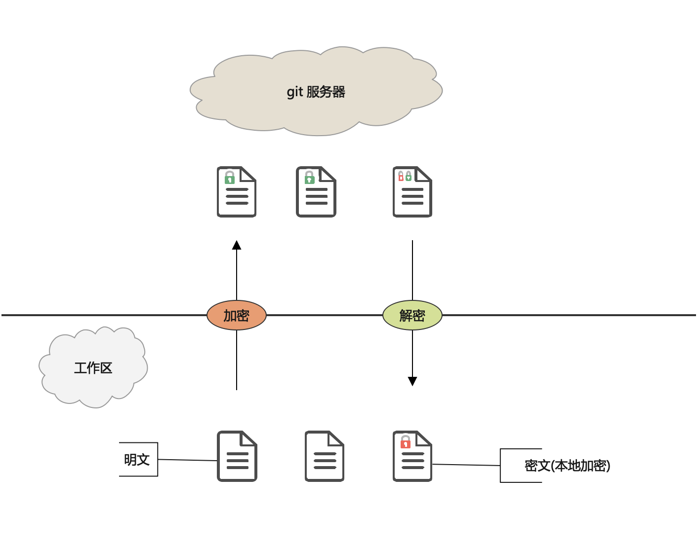

## Overview

   

### 1. What is GitLocker?

GitLocker is a tool that supports git double encryption.

**FEATURE**:
1. Remote transparent encryption
2. Local encryption
3. Support diff and merge operations in encrypted mode
4. Can be seamlessly integrated with standard Git

### 2. Why GitLocker?

There are two problems when saving important data or code to a git server:

1. How to ensure the security of data on the server?
2. How to ensure the security of local data?

### 3. How GitLocker work?

GitLocker provides double encryption scheme:

1. **Remote Transparent Encryption**

The data is encrypted before being stored in the git repository, and decrypted when the data is taken out from the git repository to the work area.  
In this way, the data stored in the git repository and the server is always encrypted, and at the same time, the data in the workspace is in clear text (without local encryption)

>*Use the same key for the entire repository*

2. **local encryption**

Workspace files also support encryption.
In local encryption mode, each file has an independent password.
> Forgot password cannot decrypt data!!!

### 4. mechanism

